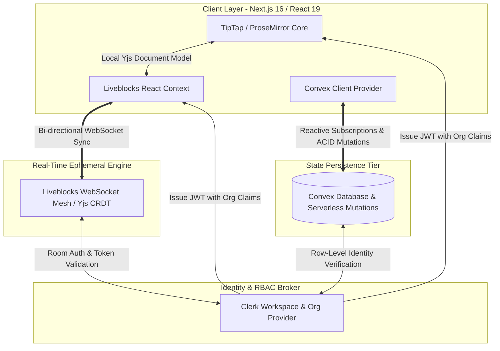

# collaborative-editor-platform

> A distributed, low-latency collaborative document editing platform engineered with Conflict-free Replicated Data Types (CRDTs), transactional backend state synchronization, and fine-grained enterprise multi-tenant isolation.


---

## Technical Overview

`collaborative-editor-platform` is an enterprise-grade collaborative workspace built to deliver deterministic sub-50ms peer synchronization and robust multi-tenant data governance. By decoupling ephemeral real-time state synchronization (handled over WebSockets via CRDTs) from transactional persistence operations (handled via serverless backend mutations), the platform achieves concurrent editing guarantees without lock contention or data degradation.

---

## Architecture & Data Flow

The architecture operates across three distinct operational layers: **Client Engine**, **Real-Time CRDT Mesh**, and **State Persistence Infrastructure**.



### Data Flow Execution Model
1. **Document Initialization & Authorization**: The user authenticates via Clerk. Upon navigating to a document room, the client fetches document metadata from Convex while requesting a secure room access token signed with organization claims.
2. **Ephemeral Concurrent Sync**: Document operations are serialized into Yjs update vectors. Liveblocks relays these delta updates over WebSockets across connected clients, resolving concurrent mutations locally in memory via CRDT state convergence.
3. **State Persistence & Storage**: High-frequency document state changes are kept in the real-time room mesh. Persistent attributes (title changes, room ownership, and metadata) are mutation-triggered against Convex using debounced transport hooks.

---

## Core Engineering Features

### 1. CRDT-Based Multiplayer Synchronization
* **Mechanism**: Integrated Yjs Conflict-free Replicated Data Types managed via Liveblocks WebSocket rooms.
* **Execution**: Rather than submitting full-document text payloads over HTTP, edits are converted into operational deltas (Y.Doc updates). Mathematical commutativity guarantees that all client replicas reach identical eventual state without needing a centralized document lock server.

### 2. Custom TipTap & ProseMirror Extension Engine
* **Mechanism**: Native ProseMirror schema extension development (`FontSize`, `LineHeight`, and interactive layout margin rulers).
* **Execution**: Extended TipTap core extensions from scratch using custom HTML parsing (`parseHTML`) and attribute rendering (`renderHTML`) rules. Overrode default node spec commands to enforce pixel-precise layout control and DOM style attribute injection.

### 3. Enterprise Multi-Tenant RBAC & Security Isolation
* **Mechanism**: Organization-bounded workspaces managed via Clerk JWT custom claims, enforced server-side within Convex mutations.
* **Execution**: Access tokens embed current `org_id` context. Convex backend database query functions validate the caller's identity context at execution time, blocking cross-organization data leakage at the database layer.

### 4. Real-Time Presence Engine & Dynamic Cursors
* **Mechanism**: Ephemeral state broadcasting powered by Liveblocks presence hooks (`useOthers`, `useMyPresence`).
* **Execution**: Broadcasts low-payload cursor coordinates, active text selection ranges, and user avatar metadata over WebSocket channels. Bypasses persistent storage entirely to eliminate database write overhead.

### 5. Network Optimization & Debounced Backend Mutations
* **Mechanism**: Custom asynchronous debouncing layer (`useDebounce`) integrated into React input hooks.
* **Execution**: Coalesces rapid keyboard events into single transactional database calls. Reduces network traffic during document title updates or auto-saves by up to 90% while guaranteeing final state write completeness.

### 6. Full-Text Indexed Search & Infinite Pagination
* **Mechanism**: Database-level indexing combined with server-assisted cursor pagination via Convex.
* **Execution**: Schema-indexed queries (`by_organization_id`) enable sub-millisecond document lookups. Document lists are paginated on-demand, minimizing initial payload size and client DOM overhead.

---

## Technology Stack Specifications

| Layer | Technology | Engineering Purpose |
| :--- | :--- | :--- |
| **Framework** | Next.js 16 (App Router) | Server-driven routing, React Server Components (RSC), and edge route handlers. |
| **UI Library** | React 19 | Concurrent rendering features and unified state management. |
| **Real-Time Engine**| Liveblocks | Managed WebSocket infrastructure for Yjs CRDT room orchestration. |
| **Database & API** | Convex | Reactive database with transactional serverless mutations and real-time backend sync. |
| **Authentication** | Clerk | Organization workspace management, JWT signing, and RBAC token generation. |
| **Editor Core** | TipTap / ProseMirror | Headless, schema-driven rich text editing framework. |
| **Styling** | Tailwind CSS v4 + Shadcn UI | Utility-first styling engine paired with Radix UI headless accessibility primitives. |

---

## Directory Structure

```
├── convex/                  # Database schemas, serverless backend functions & auth rules
│   ├── auth.config.ts       # JWT provider configuration (Clerk validation)
│   ├── documents.ts         # Mutation, query, and search endpoint definitions
│   └── schema.ts            # Typed database schema definitions & indices
├── src/
│   ├── app/                 # Next.js 16 App Router pages and layout structure
│   ├── components/          # Reusable UI components & Shadcn interface elements
│   ├── extensions/          # Custom TipTap node extensions (FontSize, LineHeight)
│   ├── hooks/               # Custom utility hooks (Debounce, Presence, State)
│   ├── lib/                 # Utility helpers and server fetch abstractions
│   └── store/               # Global state modules
├── liveblocks.config.ts     # Liveblocks room type definitions & presence parameters
└── package.json             # Workspace dependencies and lifecycle scripts
```

---

## Quick Start & Local Development

### Prerequisites
- **Node.js**: `v20.x` or later
- **Package Manager**: `npm` / `pnpm` / `bun`
- **Convex CLI**: For backend schema deployment and local development sync

### 1. Environment Configuration
Create a `.env.local` file in the root directory:

```env
# Next.js App
NEXT_PUBLIC_APP_URL=http://localhost:3000

# Clerk Auth
NEXT_PUBLIC_CLERK_PUBLISHABLE_KEY=pk_test_...
CLERK_SECRET_KEY=sk_test_...
NEXT_PUBLIC_CLERK_SIGN_IN_URL=/sign-in
NEXT_PUBLIC_CLERK_SIGN_UP_URL=/sign-up

# Convex Database
CONVEX_DEPLOYMENT=dev:...
NEXT_PUBLIC_CONVEX_URL=https://...

# Liveblocks Real-Time Engine
LIVEBLOCKS_SECRET_KEY=sk_prod_...
```

### 2. Dependency Installation
```bash
npm install
```

### 3. Initialize Convex Backend Engine
In a separate terminal session, spin up the Convex backend sync service:

```bash
npx convex dev
```

### 4. Execute Local Server
Launch the Next.js development server:

```bash
npm run dev
```

Open [http://localhost:3000](http://localhost:3000) in your browser to inspect the application.

---

## Production Verification & Build

To compile static assets and run production verification checks:

```bash
# Type check and build Next.js output
npm run build

# Run ESLint validation
npm run lint
```

---

## License

Distributed under the MIT License. See `LICENSE` for details.
